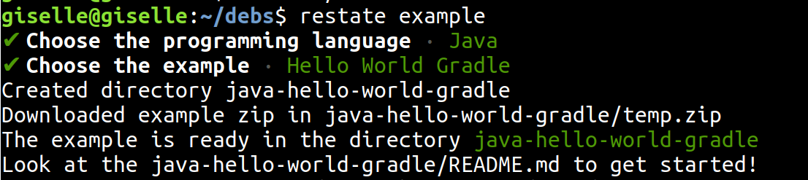
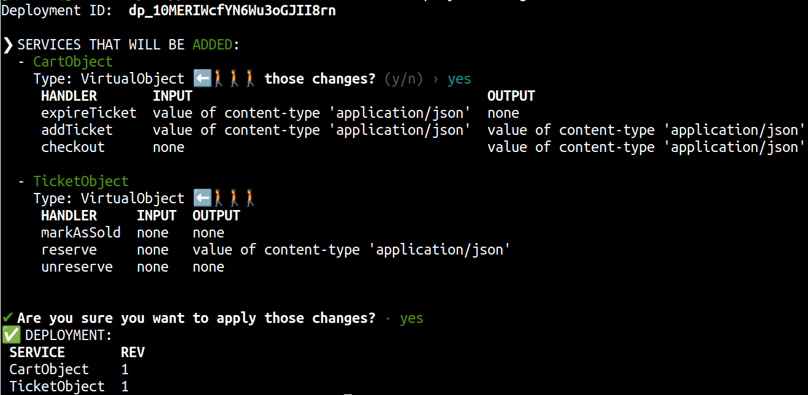
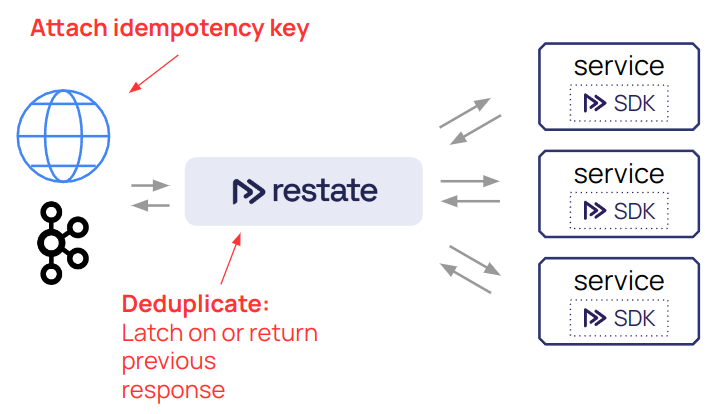

# DEBS 2024 - Restate Tutorial - Concert ticketing system


# Set up local dev environment
Go to docs.restate.dev → Develop → Local Dev
https://docs.restate.dev/develop/local_dev#running-restate-server--cli-locally 


Download the Restate Server and CLI in your preferred way

# Get the template
```
restate example java-hello-world-gradle
```



# Open the project in an IDE

# Create the CartObject

Virtual Object tracking the cart content of the user. 

Keyed by user ID.

1. Create a class `CartObject`
2. Add the @VirtualObject annotation
3. Define three handlers
	a. addTicket(String ticketId) -> boolean success
	b. expireTicket(String ticketId) -> void
	c. checkout() -> boolean success

# Create the TicketObject

Virtual Object representing a single ticket in the system. 

Keyed by ticket ID.

1. Create a class `TicketObject`
2. Define three handlers
	a. reserve() -> boolean success
	b. unreserve() → void
	c. markAsSold() → void

# Serving the Virtual Objects
- Create an AppMain class with a main method
- Create an RestateHttpEndpoint 
- Bind the two objects to the endpoint
- Listen on default port 9080
- In `build.gradle.kts` change the mainClass (Greeter → AppMain)

```kotlin
application {
 mainClass.set("my.example.AppMain")
}
```

# Run the application
Via the run button in the IDE or via

```shell
./gradlew run
```

# Register the services
Via the Restate CLI:

```shell
restate deployments register http://localhost:9080
```



# Invoking the services
## Invoking a TicketObject

```shell
curl -X POST localhost:8080/TicketObject/ticket1/reserve

curl -X POST localhost:8080/TicketObject/ticket1/unreserve

curl -X POST localhost:8080/TicketObject/ticket1/markAsSold
```

## Invoking a CartObject

Add a ticket to Mary’s cart:

```shell
curl localhost:8080/CartObject/Mary/addTicket 
-H 'content-type: application/json' 
-d '"seat2B"'
```

Let Mary buy the ticket:

```shell
curl -X POST localhost:8080/CartObject/Mary/checkout
```

# Implementing `TicketObject/reserve`
1. Get the “status” from Restate K/V state
2. If the status equals “Available”, then 
	a. set it to “Reserved”
	b. return true
3. Else 
	a. return false

# Implementing the other two TicketObject handlers
## `TicketObject/unreserve`
If the status does not equal “Sold”, then clear it.

## `TicketObject/markAsSold`
If the status equals “Reserved”, then set it to “Sold”.

# What do we have now?
- For each ticket, a permanently living object in Restate
- Requests are executed one-by-one
- **Durable, consistent state machine**

Try it out by reserving tickets and see the status change:

```shell
restate kv get TicketObject ticket1
```

# Implementing `CartObject/addTicket`
1. Reserve the ticket → TicketObject/reserve
2. If success
	a. Get Set of ticket IDs from K/V state
	b. Add current ticketID to the state
	c. Set timer to expire ticket in 15 minutes
3. Else return false

# Implement `CartObject/checkout`
1. Get the tickets from state and check if they are not empty
	a. If empty, return false
2. Do the payment
	a. Generate a resilient, unique payment identifier
	b. Do the payment by creating a stub 
	```java
    private boolean pay(String idempotencyKey, double totalPrice){
        System.out.println("Paying tickets for " + idempotencyKey + " and price " + totalPrice);
        return true;
    }
	```


# Intermezzo: Resiliency and debugging
Throw an exception in the addTicket handler and see how Restate handles retries:

```java
throw new IllegalStateException("The handler failed");
```

Debug with the CLI:

```shell
restate invocations list
restate invocations describe <id> 
```

# Continue the implementation of `CartObject/checkout`
1. If payment was success, 
	a. Call TicketObject/markAsSold for each ticket
	b. Clear the state
	c. Return true (success)
2. Else return false (failure)

# Implementing `CartObject/expireTicket`
1. Remove the ticket from the tickets set
2. If the ticket got removed, then call TicketObject/unreserve

# The final mile: idempotency for any request




```shell
curl localhost:8080/CartObject/Mary/addTicket 
   -H 'content-type: application/json' \
   -H 'idempotency-key: ad5472esg4dsg525dssdfa5loi'  \
   -d '"seat2C"'
```
Check the service logs → no re-execution


# 🎉 Done!